# Dense and tall scripts

## Collections

We provide the necessary adjustments for the predefined collections for both
dense and tall scripts. They have the exact same properties as the other
collections.

You can check the language categories reference in the
[Material Design page](https://material.io/guidelines/style/typography.html#typography-language-categories-reference).

### Material Design

```JSX
import { materialDense, materialTall } from 'react-native-typography'
```

The adjustments made are based on the
[Material Design guidelines](https://material.io/guidelines/style/typography.html)
for dense and tall scripts.

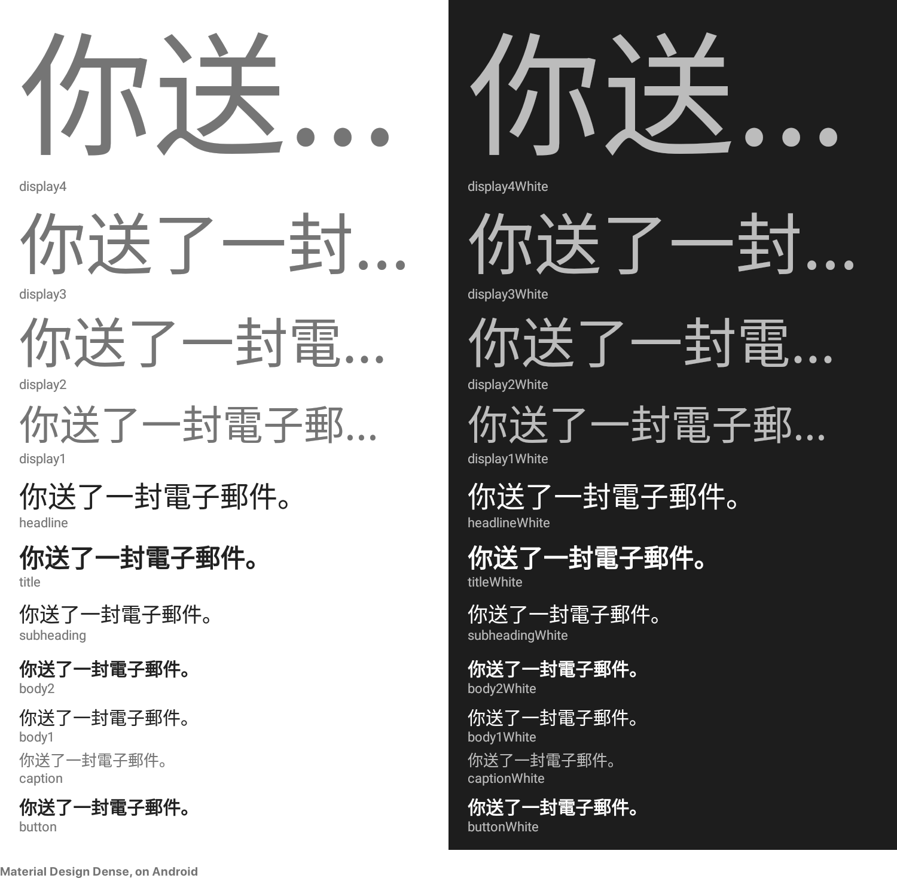
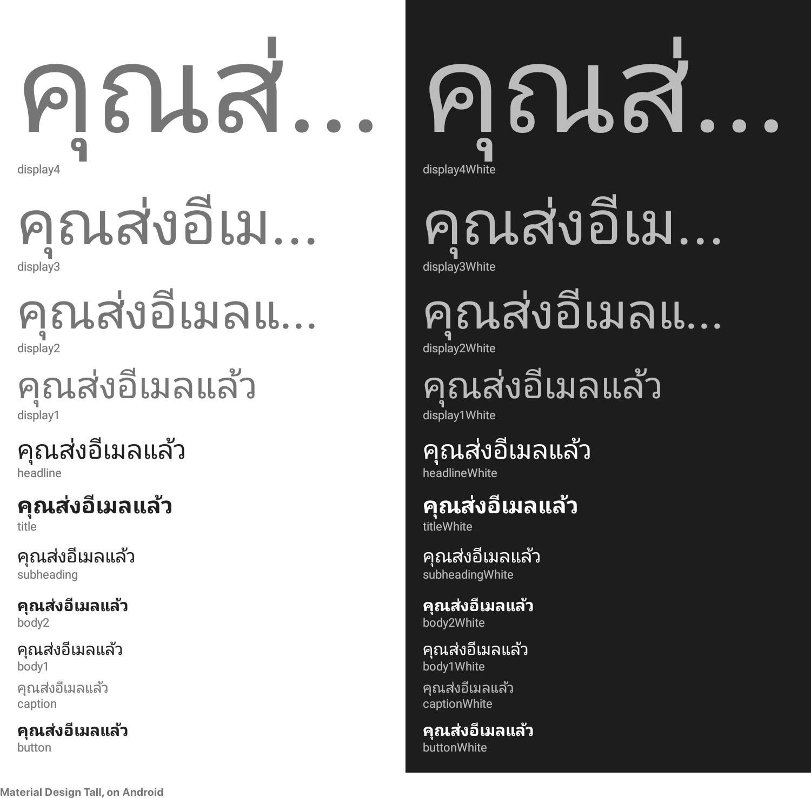

### Human Interface Guidelines

```JSX
import { humanDense, humanTall } from 'react-native-typography'
```

The adjustments here are minor and just to ensure proper rendering on all
platforms.

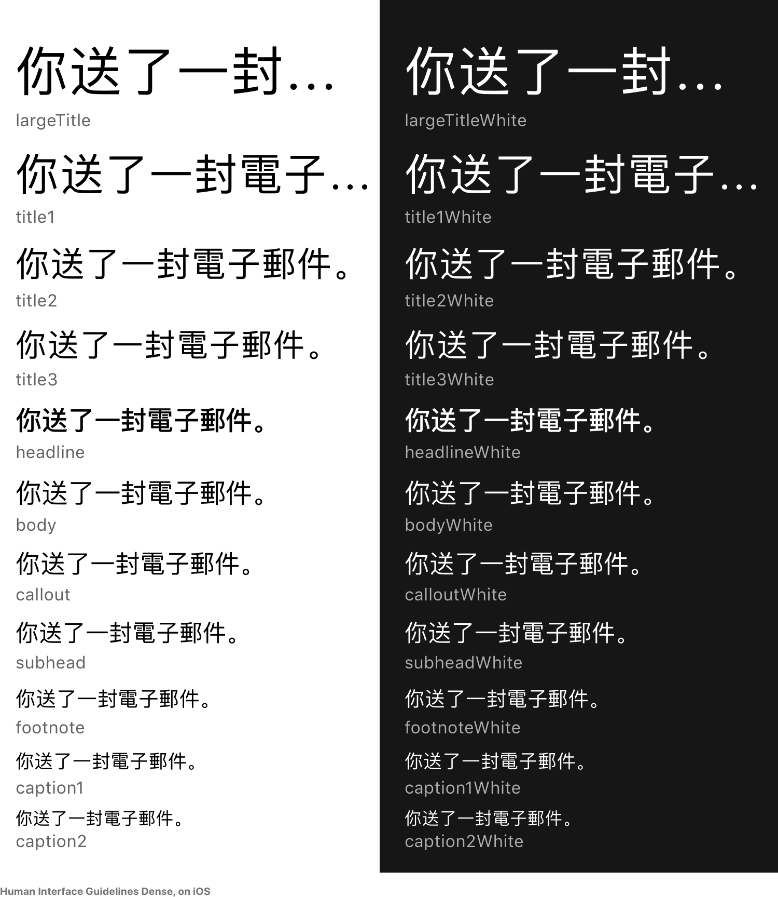
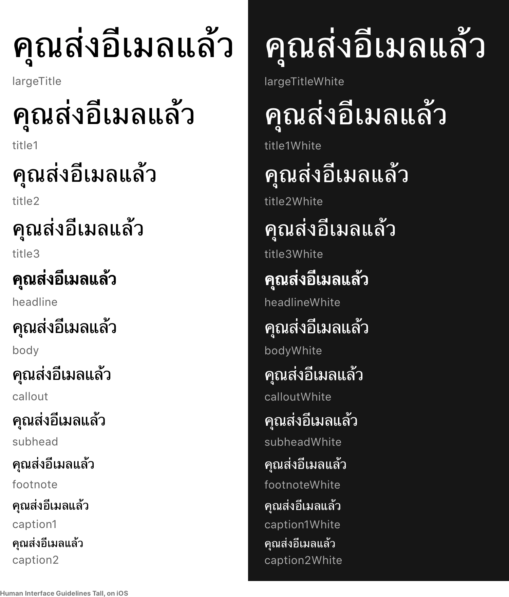

### iOSUIKit

```JSX
import { iOSUIKitDense, iOSUIKitTall } from 'react-native-typography'
```

The adjustments here are minor and just to ensure proper rendering on all
platforms.
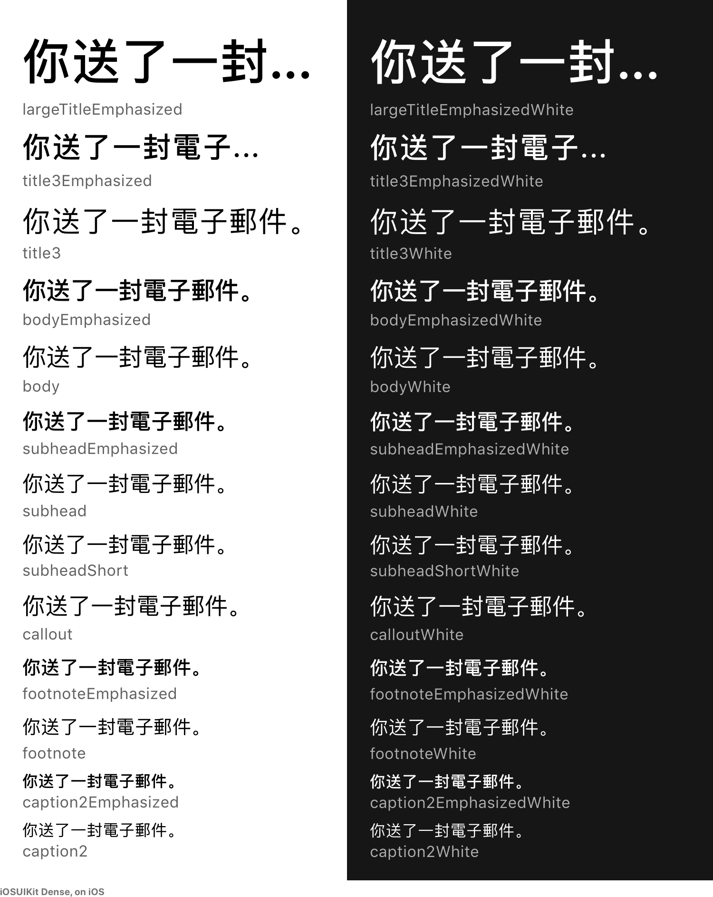
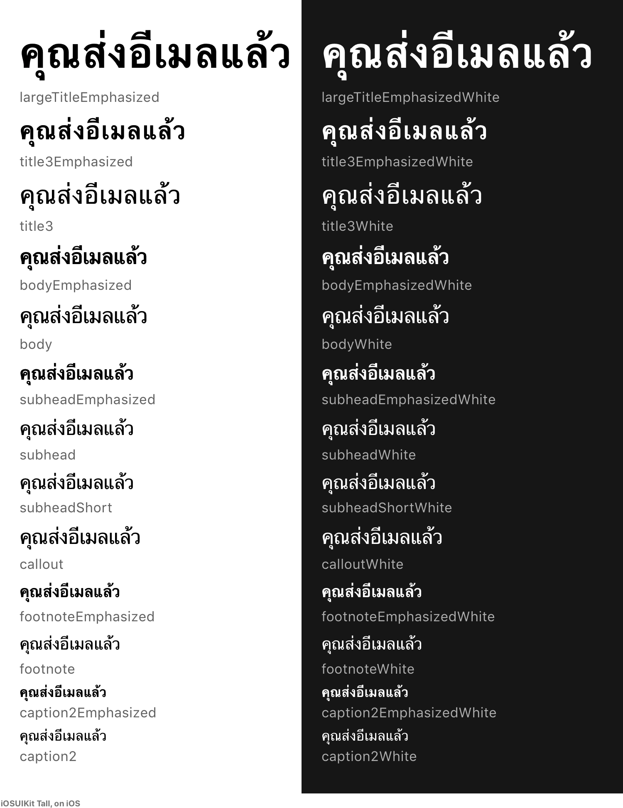

## Weight helpers

The weight helpers for dense and tall scripts are different, as they render
using different fonts and weights on each platform.

On iOS the San Francisco font is used for all scripts.

On Android the Noto font is used to render the dense and tall scripts, in two
variants.

The System weights render visually similar weights of the **San Francisco/Noto
typefaces** on each platform.

### System Dense Weights

```JSX
import { systemDenseWeights } from 'react-native-typography'
```

Not all dense languages have every weight in iOS or on Android, we try to match
it to the closer existing value, but ultimately every weight might fall back to
regular or bold depending on what's available.

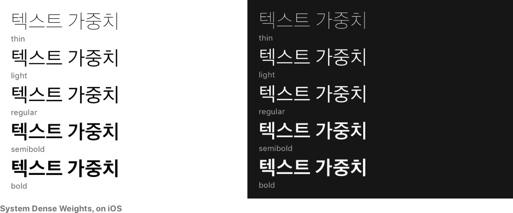
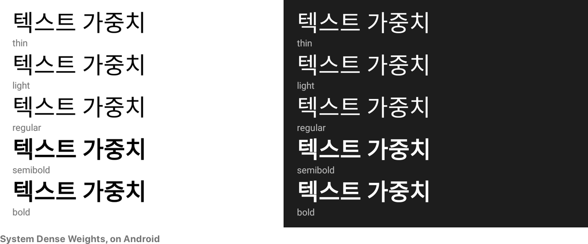

### System Tall Weights

```JSX
import { systemTallWeights } from 'react-native-typography'
```

Noto Sans only has two weight values for tall scripts, so we fall back to the
closest value. For iOS there are some other weights available depending on the
language.

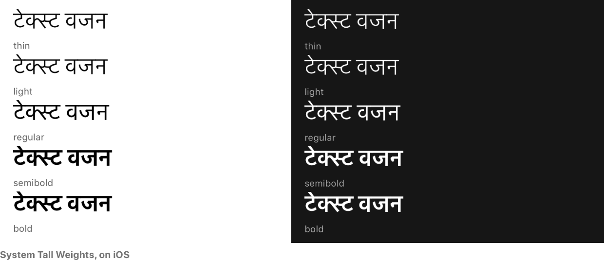
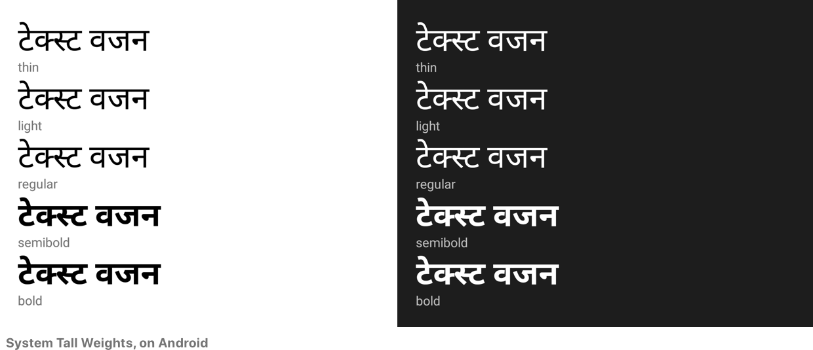

### Noto CJK Weights

```JSX
import { notoCJKWeights } from 'react-native-typography'
```

These weights are **only functional on Android**, as they directly reference the
native Noto CJK typeface.

Noto Sans CJK has seven weight values originally, but they are not shipped with
Android for now, so we only have regular and bold.

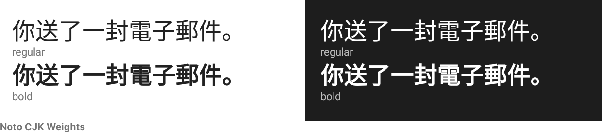

### Noto Tall Weights

```JSX
import { notoTallWeights } from 'react-native-typography'
```

These weights are **only functional on Android**, as they directly reference the
native Noto typeface.

For the tall scripts there is only regular and bold available.

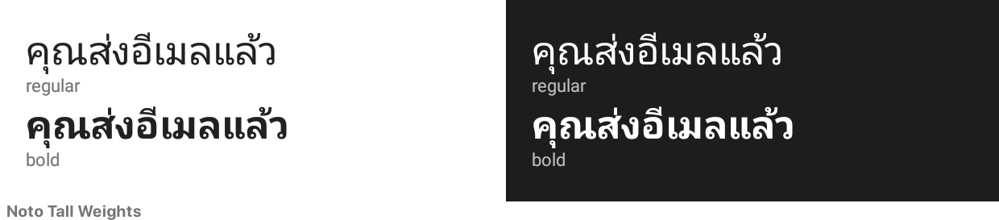
